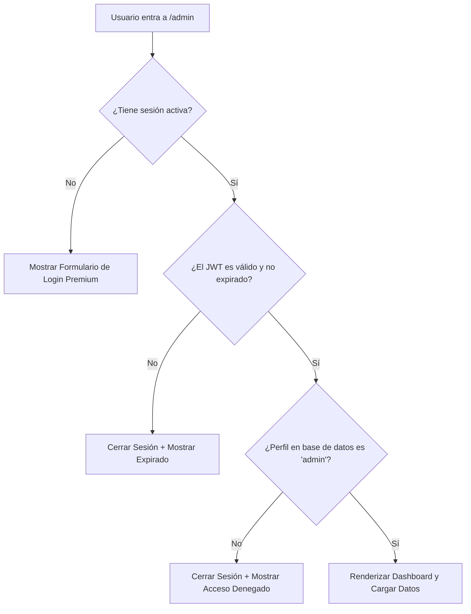

# Contexto del Proyecto: Securización del Panel de Admin de Alcoviajes

Este documento resume los cambios, la arquitectura y las credenciales del sistema de autenticación de administrador implementado en Alcoviajes.

---

## 🔑 Credenciales de Prueba
Para propósitos de prueba en el panel local de administración (`/admin`):

### 1. Administrador (Acceso Autorizado)
* **Correo:** `admin@alcoviajes.com`
* **Contraseña:** `AdminPassword123!`
* **Rol:** `admin`

### 2. Cliente (Acceso Denegado)
* **Correo:** `client@alcoviajes.com`
* **Contraseña:** `ClientPassword123!`
* **Rol:** `client`

---

## 🏗️ Arquitectura de Seguridad y Flujo de Trabajo

El sistema de seguridad consta de tres capas principales para garantizar que las operaciones CRUD de destinos y paquetes solo puedan ser realizadas por administradores autorizados:

### 1. Base de Datos (Supabase PostgreSQL)
* **Tabla `public.profiles`**: Almacena información adicional de los usuarios, incluyendo su rol (`admin` o `client`).
* **Trigger y Función (`handle_new_user`)**:
  * Escucha la creación de nuevos usuarios en `auth.users`.
  * Asigna automáticamente el rol `'admin'` al correo `admin@alcoviajes.com`, y `'client'` a cualquier otro usuario.
  * Inserta la fila correspondiente en `public.profiles`.
* **Seguridad RLS (Row Level Security)**:
  * Habilitado en la tabla `public.profiles`.
  * Política: Los usuarios autenticados solo pueden leer su propio perfil.

### 2. Utilidad JWT Client-Side (`src/lib/jwtHelper.js`)
* **`decodeJWT(token)`**: Decodifica el payload en Base64Url de forma segura para extraer metadatos del token.
* **`isTokenExpired(token)`**: Compara el campo `exp` del JWT con el tiempo actual del sistema para verificar expiración.
* **`validateSessionToken(token)`**: Asegura que el token emitido tenga la estructura correcta y esté vigente antes de iniciar consultas a la API de Supabase.

### 3. Frontend y Componente Dashboard (`src/pages/AdminDashboard.jsx`)
* **Portal de Acceso Integrado**: Si el usuario no está autenticado como administrador, se oculta todo el contenido del panel y se presenta un formulario de inicio de sesión visualmente premium.
* **Carga Segura de Sesión**:
  * Un spinner dinámico animado bloquea la pantalla mientras se verifica el token y el perfil de la base de datos de Supabase de manera asíncrona.
  * Escucha en tiempo real cambios de autenticación (`SIGNED_IN`, `SIGNED_OUT`, `TOKEN_REFRESHED`).
* **Header de Sesión**:
  * Muestra el correo electrónico del administrador actual.
  * Añade una insignia visual con el rol **ADMIN**.
  * Incorpora un botón **Salir** (Logout) que limpia de manera segura la sesión de Supabase y redirige al formulario de inicio de sesión.
* **Depuración**: Exposición segura de la instancia de `supabase` en `window.supabase` en el cliente para validación y testing desde la consola.

---

## 🛠️ Archivos Creados/Modificados

1. **`src/lib/jwtHelper.js`** [NUEVO]: Utilidad JavaScript pura para manejo y validación segura de tokens JWT.
2. **`src/pages/AdminDashboard.jsx`** [MODIFICADO]: Lógica de enrutamiento protegida, verificación asíncrona de roles en perfiles, diseño visual del portal de login premium e inclusión de botones de salida en el header.
3. **`src/lib/supabaseClient.js`** [MODIFICADO]: Inclusión del helper `window.supabase = supabase` en entornos cliente para testing interactivo.
4. **`agents/context.md`** [NUEVO]: Esta documentación de contexto histórico del desarrollo.
